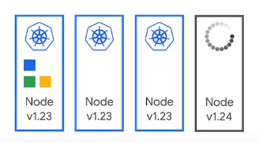

### So sánh giữa Surge Upgrade và Blue-Green Upgrade

### Default node pool upgrades GKE
Giả sử 1 node pool có 3 node ta tiến hành upgrade node pool lên phiên bản mới

  

- Khi upgrade node pool lên phiên bản mới, GKE sẽ tiến hành tạo một node "surge" mới.

  

- Sau khi hoàn thành ta có 4 node trong cluster

  

  

- Quá trình upgrade sẽ bắt đầu tắt 1 trong các node cũ (cordoning và draining node cũ để đảm bảo không có workload nào đang chạy trên node cũ) sau đó xóa node cũ đó đi.
- Các node mới sẽ được tạo ra và workload sẽ được chuyển sang các node mới, phải được lên lịch lại từ node cũ.

  

- Ta có thể thay đổi số lượng "surge" node, vd trên khi set `max-surge-upgrade=2` và cấu hình số lượng node có thể được phép down `max-unavailable-upgrade`.

### Blue-Green Upgrade

  

- Phase 1: Tạo mới số lượng "green" node bằng với số lượng node đang có trong node pool.

  

- Phase 2: Cordon tất cả các node "blue" cũ trong node pool.

  

- Phase 3: Drain tất cả các node "blue" cũ trong node pool. Xóa các workload đang chạy trên các node "blue" cũ và cho phép chúng chạy trên các node "green" mới. Các node "blue" cũ sẽ có 1 khoảng thời gian để phục vụ cho các workload cũ hoàn thiện các công việc trước khi dừng hẳn và node rollback nếu cần.
- Phase 4: Soak time, 1 khoảng thời gian được người dùng định nghĩa để quan sát quá trình chạy của các workload trên node "green" mới nếu có sự cố gì thì dễ dàng có thể rollback về node "blue" cũ.
- Phase 5: Nếu không có vấn đề gì sau soak time, các node "blue" cũ sẽ được giải phóng và node pool quay trở lại với mô hình 3 node ban đầu với version được upgrade.

### So sánh với Cluster-API
- Với cách upgrade cluster hiện tại của Cluster-API giống với Surge Upgrade của GCP.
    - Mặc định MachineDeployments sử dụng RollingUpdate với "surge of 1" tức là machine được thay thế 1 - 1.
    - Ta có thể cấu hình [changes are rolled out by honouring MaxUnavailable and MaxSurge values. Only values allowed are of type Int or Strings with an integer and percentage symbol e.g “5%”.](https://cluster-api.sigs.k8s.io/tasks/upgrading-clusters.html) (cái này tương tự như set `max-surge-upgrade=2` và `max-unavailable-upgrade` trong GKE).
- Chưa có cấu hình cho Blue-Green Upgrade.